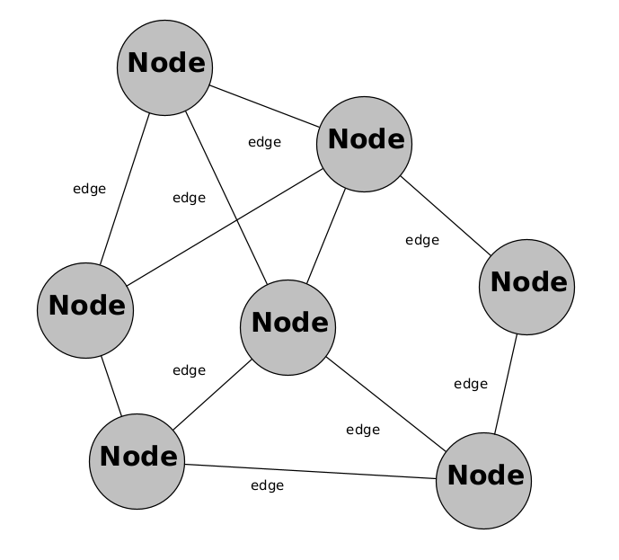
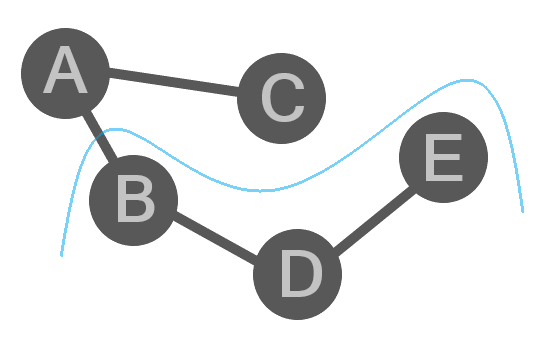
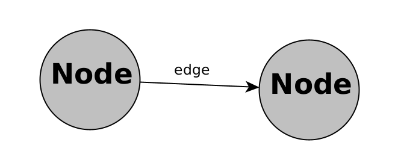
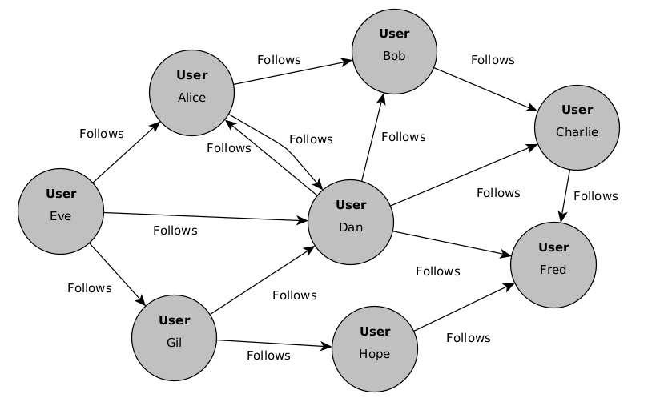
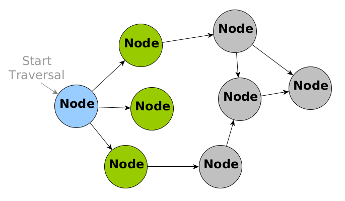
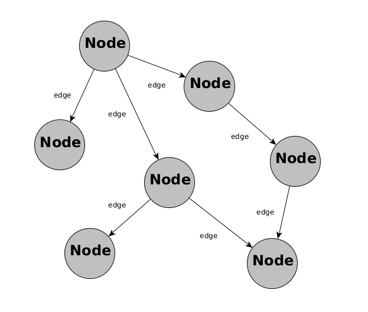
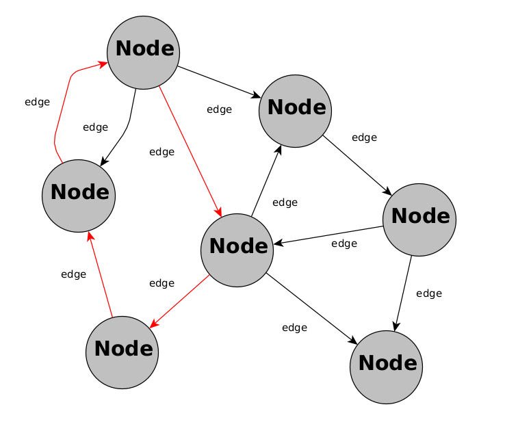
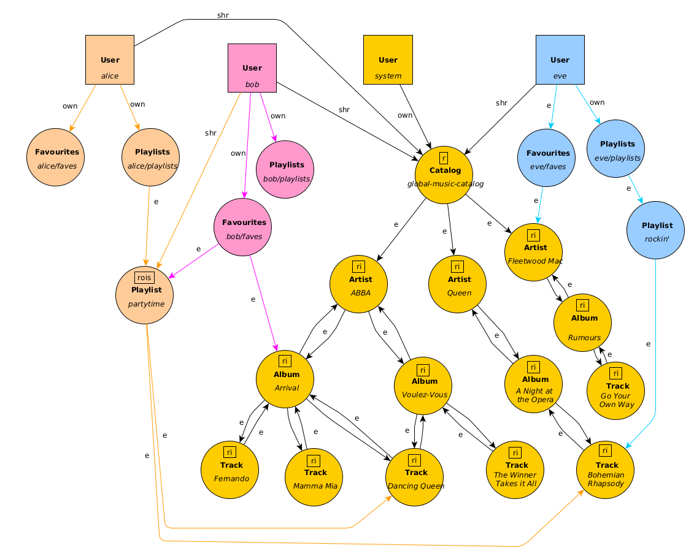
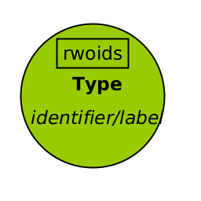

# How to Build Apps with Cogged

Cogged is designed around the concept of graphs. Before building apps with Cogged, you will need an understanding of how graphs and graph databases work.

## Graphs

When dealing with information, a graph is a way of representing and organising data. It consists of two main components: nodes and edges.

1. **Nodes:** Nodes are the basic building blocks of a graph. In the context of data, nodes represent individual entities, objects, or elements. For example, if modeling a social network, nodes could represent users. In a banking application, nodes could represent customers, accounts, cards and transactions.

2. **Edges:** Edges are the connections or relationships between nodes. They define how nodes are related to each other. In the social network example, edges could represent friendships between users. Each edge connects two nodes and indicates some kind of association or interaction.

The following diagram illustrates the concept of nodes and edges representing connections between entities:



In simple terms, a graph is like a visual or conceptual representation of connections between different pieces of information. Nodes are the entities, and edges are the relationships between them. This structure is versatile and can be used to model various types of relationships and dependencies in data, making it a powerful tool in information representation and analysis.


**Subgraphs**

A term that is used when discussing graphs is subgraph, which means a subset of nodes and edges within a larger graph. The nodes and edges in a subgraph will all be interconnected with each other. The following diagram shows a graph consisting of nodes A-E. The nodes B, D and E (and the edges between them) form a subgraph




## Directed Graphs

In a directed graph (also known as a digraph), the edges have a direction. This means that the relationship represented by the edge is one-way. Each edge has a starting node (tail) and an ending node (head).



Some key points about directed graphs are:

1. **Edges with Direction:** In a directed graph, each edge has an associated direction. This direction is important and indicates a specific flow or relationship from one node to another.

2. **Arrow Representation:** Directed edges are often represented with arrows. The arrow points from the starting node (tail) to the ending node (head). This visually represents the direction of the relationship.

3. **In-Degree and Out-Degree:** The in-degree of a node in a directed graph is the number of edges pointing towards the node. The out-degree is the number of edges pointing away from the node. This distinction helps analyse the flow of relationships in the graph. In the example diagram above, the in-degree of the node on the right is one, and the out-degree of the node on the left is one. If there was another node in the graph with an arrow pointing to the node on the right, the in-degree of the node on the right would increase by one and become two.

#### Example

If you think of a social media network, a directed edge could represent the "follows" relationship. If User A follows User B, there would be a directed edge from A to B. However, this doesn't imply that B follows A unless there is another directed edge from B to A.

The diagram below illustrates a social network where users follow other users. The "follows" relationship is represented by a directed edge. The only case where User A follows User B and User B follows User A in a mutual "follows" relationship is with Alice and Dan:



The direction of edges in a directed graph matters in understanding the relationships between nodes. This is a useful concept for modeling scenarios where relationships have a clear source and destination.

## Traversal

The process of following the edges of a graph is called traversal.

In a directed graph, a traversal can follow the directions of the edges, and can also be done in reverse, going in the opposite directions of the edges.

A traversal can be limited in terms of how many edges it follows. This limit is referred to as the depth of the traversal.

#### Example

In the example graph diagram below, starting at the blue node on the left, a traversal with a depth of 1 only follows one "hop" of outgoing edges from the start node to the nodes connected by those edges (highlighted in green in the diagram). The traversal stops before the nodes in grey are visited:



## Acyclic vs Cyclic Graphs

There are two types of directed graphs: Directed Acyclic Graphs (DAG) and Directed Cyclic Graphs (DCG). Cogged uses directed cyclic graphs (DCGs).

A cycle is a "loop" that occurs when traversing the graph. Basically it means that following the edges takes a path where the traversal ends up back where it started.

**Acyclic Graphs**

Acyclic graphs are directed graphs that do not contain cycles. A property of a DAG is that if you start at one node and follow the edges of the graph according to their direction, you will eventually reach a node that has no outgoing edges.

The following diagram shows a DAG. Pick any node in the diagram and follow the arrows until you reach a node without any outgoing arrows. Note that whichever path is followed, there are only two nodes (at the bottom of the diagram) where the traversal will end:



**Cyclic Graphs**

Cyclic graphs are directed graphs that contain traversal cycles.

In Cyclic graphs, it is possible (but not always the case) that if you start at one node and follow the directed edges of the graph, you may eventually reach a node that has an outgoing edge that points back to the starting node, which forms a cycle.

The following example graph is a DCG, where several cycles exist. One of those cycles is highlighted using red edges:



The main difference between DCGs and DAGs is that there can be cycles or loops when traversing a DCG, whereas following a path in a DAG will always be guaranteed to terminate at a node.

DCGs are used in Cogged to implement access control for nodes. The graph schema needs to be carefully designed to ensure private data is not accidentally exposed as public/shared data. This will be discussed in more detail below.

## Graph Databases

A graph database is a type of database management system (DBMS) designed for the storage and retrieval of data with a graph structure. In a graph database, data is organised as nodes and edges, reflecting the relationships between entities. Nodes and edges can have properties. This structure is suited for scenarios where relationships between data points are as important as the data itself.

Some key characteristics and differences between graph databases and relational databases are summarised in the table below:

|Aspect|Graph DB|Relational DB|
|-|-|-|
|Data Model|Data is represented as nodes, edges, and properties. Nodes typically represent entities (e.g., people, products), edges represent relationships between nodes, and properties store additional information about nodes and edges|Data is organised into tables, with rows representing records and columns representing attributes. Relationships are typically represented using foreign keys.|
|Schema|Are often schema-less or have a flexible schema, allowing for dynamic changes to the structure without requiring a predefined schema.|Have a fixed schema that defines the structure of the data and relationships beforehand.|
|Query Language|Often use specialised query languages optimised for traversing and querying graph structures. For example Cypher is a query language used in Neo4j, and Dgraph has Dgraph Query Language (DQL).|Use SQL (Structured Query Language) for querying, which is designed for working with tabular data.|
|Performance on Relationship Queries|Excel at querying relationships and traversing graphs. Queries about connected data are typically more efficient in a graph database.|Can handle relationships, however complex queries involving multiple joins might become less efficient as the size of the dataset grows.|
|Use Cases|Well-suited for scenarios where relationships are a key focus, such as social networks, recommendation systems, fraud detection, network analysis, and knowledge graphs.|Are suitable for a wide range of applications, especially when the data is primarily tabular and relationships are not the main focus.|
|Scalability|Can scale horizontally to handle large and interconnected datasets efficiently.|Can scale vertically (by adding more powerful hardware) or through sharding, but handling highly interconnected data might require additional optimisations.|

To summarise, graph databases are designed to efficiently handle and query highly interconnected data, making them suitable for specific use cases where relationships play a central role. Relational databases are more general-purpose and excel in scenarios where tabular data and structured queries are predominant. The choice between them depends on the nature of the application's data and its requirements for interacting with that data.


## Dgraph

Cogged uses Dgraph as its backend DBMS.

Dgraph is a distributed, open-source, native graph database designed to handle large, complex datasets with high-performance querying and real-time updates.

Some of Dgraph's key features include:

**Native Graph Storage:**
- Stores data as a graph, where nodes represent entities and edges represent relationships, directly matching the natural structure of many real-world domains.
- This leads to efficient graph traversals and fast query execution, especially for graph-oriented tasks.

**GraphQL Support:**
- Offers built-in support for GraphQL, a powerful query language designed for APIs and data fetching.
- Dgraph's GraphQL implementation is optimised for graph data, providing a seamless API for interacting with the database.

**Horizontal Scalability:**
- Can be scaled horizontally across multiple machines to handle massive datasets and high query volumes without performance degradation.
- This makes it suitable for large-scale applications with growing data needs.

**Real-Time Updates:**
- Supports real-time updates and subscriptions, enabling applications to react to changes in the database immediately.
- This is valuable for building real-time systems and applications that require live updates.

**ACID Transactions:**
- Ensures data consistency and integrity through ACID (Atomicity, Consistency, Isolation, Durability) transactions.
- This is essential for applications that require reliable and predictable data behavior.

**Full-Text Search:**
- Provides built-in full-text search capabilities, allowing you to index and search text fields efficiently.
- This enables powerful text-based queries and retrieval.

**Automatic Schema Inference:**
- Eliminates the need for manual schema definition, as it automatically infers the schema from the data.
- This simplifies development and reduces management overhead.

**Cross-Datacenter Replication:**
- Supports geo-replication across multiple datacenters for high availability and disaster recovery.
- This ensures data resilience and business continuity.


## Cogged Graph Schemas

Although Dgraph provides a flexible schema, a well-defined schema is required to use some of the key features like indexing and to make operations like deleting node properties easier.

Cogged defines two types of Dgraph Nodes in its schema:
|type|description|
|-|-|
|`U`|A Cogged user|
|`N`|A generic Cogged node|

It uses three types of edges to convey relationship information between U and N type nodes:
|type|description|
|-|-|
|`e`|connects generic Nodes (N) to other generic nodes (N)|
|`own`|connects Cogged users (U) to their "root" generic nodes (N), which they own|
|`shr`|connects Cogged users (U) to generic nodes (N) owned by other users|

More detail about these core elements is included below.

### Cogged Users (U)

A Cogged user (type U) has the following predicates

|PredicateName|Type|Description|
|-|-|-|
|`uid`|uid|Dgraph has a unique ID for each node in its database|
|`un`|string|username|
|`ph`|string|password hash|
|`role`|string|The application can define arbitrary role names for users|
|`us`|string|public user information shared with all Cogged users, eg. could be used for full name, display name, avatar image, department, email address etc.|
|`intd`|string|internal data relating to the user, only available to superusers|
|`own`|uid[]|a list containing outgoing edges pointing from the user to type N nodes that the user created. These are the first level of nodes to traverse out to from the user. These can be thought of as the user's main "top-level" or "root nodes" that connect to subgraphs of data|
|`shr`|uid[]|a list containing outgoing edges pointing from the user to type N nodes that other users created and shared with the user. These nodes could be individual leaf nodes, or connect to subgraphs of data|


### Cogged Nodes (N)

Apart from users, all other information in a Cogged application is represented using a generic node (type N). Cogged uses a generic schema for type N nodes, featuring a fixed set of properties (known as predicates). These predicates have specific types (string, boolean, float, geolocation and so on). There are numerous predicates designed to cover many use cases. Although nodes may only use a few of the fixed predicates and it may seem like a waste of space to have so many, in Dgraph, if a predicate is null for a node then no data storage is used.

A Cogged type N node has the following predicates:

|PredicateName|Type|Description|
|-|-|-|
|`uid`|uid|Dgraph has a unique ID for each node in its database|
|`e`|uid[]|An array of Dgraph UIDs. The list of outgoing directed edges represent relationships between the node and other nodes|
|`own`|uid|The UID of the User that owns the node|
|`r`|bool|Permission flag that indicates whether users other than the owner or superusers can read this node's predicates|
|`w`|bool|Permission flag that indicates whether users other than the owner or superusers can update this node's predicates|
|`o`|bool|Permission flag that indicates whether users other than the owner or superusers can create an outgoing edge from this node to another node|
|`i`|bool|Permission flag that indicates whether users other than the owner or superusers can create an outgoing edge from another node to this node|
|`d`|bool|Permission flag that indicates whether users other than the owner or superusers can delete this node|
|`s`|bool|Permission flag that indicates whether users other than the owner or superusers can share this node with another user|
|`id`|string|The custom application can use this field for whatever format of unique identifier it wants for the node, e.g. `"52ca310b-9710-4749-b2a0-288a9a03b5a3"`, `"+63-875-9723-8373"`, `"namespace/category/7a2e6f4"` |
|`ty`|string|The custom application can use this field to categorise nodes into custom types or classes eg. `Project`, `Message`, `Customer`, `Vehicle`, etc.|
|`p`|string|The custom application can use this field to store data that is only visible to the node owner (or superusers)|
|`s1`|string|The custom application can use this field for arbitrary text|
|`s2`|string|The custom application can use this field for arbitrary text|
|`s3`|string|The custom application can use this field for arbitrary text|
|`s4`|string|The custom application can use this field for arbitrary text|
|`b`|string|Dgraph doesn't support raw byte data, so it must be encoded as text (eg. base64). The custom application can use this field for arbitrary text, meant to store a 'blob' or large-sized data for example binary data that has been gzipped and base64 encoded|
|`n1`|float|Application-defined numeric data|
|`n2`|float|Application-defined numeric data|
|`c`|datetime|Timestamp recording the date/time the node was created|
|`m`|datetime|Timestamp recording the date/time the node was last modified|
|`t1`|datetime|Application-defined timestamp data, eg. event start time|
|`t2`|datetime|Application-defined timestamp data, eg. event finish time|
|`g`|geolocation|Application-defined geolocation data in lat/lon coordinates, eg. event location|

## Access Control

Complex access control and data-sharing can be implemented in applications built with Cogged by using the combination of:

- U and N node types, 
- the three edge types, 
- the set of permissions on each node,
- and directed edge traversal

Cogged follows the rules below when deciding on whether to permit access for a given user to type N nodes they request from the Dgraph database:

_In the following rules, `RU` is the user requesting access to a node `GN` in the graph (to perform create, read, update, delete operations)_

- firstly, `RU` only knows about nodes that it can find via traversing out from their U node, which means nodes they created themselves, or nodes that have been shared with them by other users 
- For a node `GN`, that `RU` can reach via traversing the graph:
	- If `RU` has the `sys` role, then access is permitted
	- If `RU` is the owner of `GN` (i.e. `RU`'s `uid` equals the `GN.own.uid` predicate value) then access is permitted
	- If `RU` is not a superuser or the owner of `GN` then the permissions (`r,w,o,i,d,s`) on `GN` need to allow the requested operation: read, update, add/delete an outgoing edge, add/delete an incoming edge, delete or create a `shr` edge from a user to `GN`, respectively.

To assist with understanding how this works a simple application is used as an example. The following application schema implements a social music app, where users can create playlists of songs and share them with other users.

The diagram illustrates the schema:



- The square nodes at the top are Cogged type U users, and the circular nodes are type N nodes. 
- Nodes are colour-coded according to the user that created and owns them.
- The N nodes are visually represented using the following format:



The "rwoids" enclosed in the rectangle at the top of the circle are the node permissions, for example if the rectangle contains the string `ri`, it means the "read" and "add/delete incoming edges" permissions have been set for that node by the owner.

If no permissions are shown then all permissions are set to false.

The edges in the diagram are labelled 'e','shr' and 'own', corresponding to the edge types described in the previous sections.

### How the Example Implements Access Control 

An application service account user named "system" creates the entities representing artists, albums, tracks etc. in a globally shared catalog that will be accessible by all users in the application.
- some backend functionality needs to be implemented to automatically create the `shr` edge between a new user and the `global-music-catalog` node, for example when the user signs-up and the system creates their account.

The `ri` permissions set by the "system" user on the Artist, Album and Track nodes allow other application users to read the data, and create `e` type edges from nodes they own (such as their Playlist and Favourites nodes) to the objects in the global catalog.

It is important that the "system" user doesn't set `"o"` permissions on any of the catalog objects. That could allow normal application users to inadvertently expose their own nodes (such as Playlist or Favourites) by creating an outgoing edge from the shared node to their private node. This would create a traversal path from public/shared nodes to their own private nodes. 

However, even if that mistake were made, a mitigation that should prevent that exposure would be users not setting `"r"` permissions on their private nodes. If a traversal path were created by an edge directed from a globally shared node to the user's private node, other users would still not be able to read the private node.

An example application feature that has been implemented using the DCG schema is sharing playlists. This can be seen in the schema:

User "Alice" has shared their "partytime" Playlist with user "Bob" by creating a `shr` edge from "Bob" to the Playlist node. Bob can traverse out from that `shr` edge to the playlist and onwards to its tracks. No other users have a `shr` edge to that playlist so they cannot reach it, and therefore access it.

The "s" permission on Alice's "partytime" playlist means that Bob can also share it with other users that Bob chooses.

The "o" permission on Alice's "partytime" playlist means that Bob can add or remove tracks from it.

## AuthzData

Cogged's design relies on the server-side checking the permissions set on nodes against operations requested by a user. To do this, the application could:

1. Not send permissions or owner information with each node sent from Cogged to the client, and on every CRUD operation requested by the client, check the permissions in the database for each node UID involved in the operation. This would require a Dgraph query followed by an upsert, which is not so efficient.
2. Send the node's permissions and owner info along with the other node predicates to the client side, and have the client send it back to Cogged with the node when executing a CRUD operation (a kind of "stateless" approach). Because all the required information to make an access control decision is included with the request, there is less latency/overhead, although there is potentially some tradeoff with network bandwidth.

Although #2 could address the issue with #1, it is insecure: a user could tamper with the permissions before sending the node info back, for example setting the "write" permission on a node they shouldn't be allowed to write to.

Notwithstanding that security problem, there is another challenge with this design:

Dgraph UIDs are sequential and very predictable, they are of the format `0xNN`, for example `0x1a5,0x1a6,0x1a7`.

This means that even if malicious users can't reach an arbitrary node via graph traversal, they could guess the node UIDs, and insert them into a CRUD operation.

This type of security issue is called an Insecure Direct Object Reference (IDOR) vulnerability.

To secure against permissions tampering and IDOR, Cogged generates an "AuthzData" string and attaches it to each node returned to clients as a result of a query/traversal.

An example AuthzData string is:
```
MHgxMjMuMHhmMzhhNy5ydw.qfbxnKX605d64nlDRjfs4qthDJA5dOdunSgBIhoBu3E
```

This string is a Base64 (URL-safe) encoded token of the following format:
```
<node_info>.<hmac>
```

These fields are:
|Field|Description|
|-|-|
|node_info|made up of three parts: node_uid, owner_uid, permissions, e.g. `0x123.0x4a56.rwis`|
|hmac|a Hashed Message Authentication Code, which is a cryptographic technique that creates a type of "signature" for the node_info that can be verified by Cogged, and will detect any tampering with the node's UID, owner UID or permissions. A HMAC involves a secret key only known to Cogged, and unless an attacker knows this secret key, they cannot forge the HMAC and spoof node_info|

A unique secret key for each user is used to generate the HMAC for the AuthzData, ensuring that users cannot share AuthzData strings with other users who haven't been assigned access to nodes via the `shr` edge.

API requests that need to enforce access controls will rely on the information and HMAC in the AuthzData string attached to a recieved node to inform security decisions and ensure that information matches what is contained in the node.

## The API Documentation

Cogged exposes a REST API to interact with the framework. The API documentation is contained in the `openapi3.yaml` file in the root of the repository.

API clients in various languages can be automatically generated using tools like Swagger.
